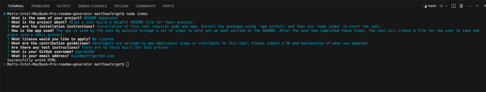

# README Generator

Built with ❤️ using:

## Description

Helps a user build a helpful README file for their project.

## Table of Contents

- [Description](#description)
- [Installation](#installation)
- [Usage](#usage)
- [License](#license)
- [Contributing](#contributing)
- [Tests](#tests)
- [Questions](#questions)

## Installation

Installation of this tool requires node and npm. Install the packages using `npm install` and then use `node index` to start the tool.

## Usage

The app is used by the user by walking through a set of steps to help set up each section of the README. After the user has completed those steps, the tool will create a file for the user to take and place into their project.

## License

No license selected

## Contributing

Developers are welcome to add additional steps or contribute to this tool. Please submit a PR and explanation of what was updated.

## Tests

There are no tests built for this project

## Questions

You can check out my other projects and reach out on my [GitHub](http://github.com/mgordon82).

If you have any questions, you can reach me at via [email](mailto:misc@mattrgordon.com).

## References

- [GitHub Repo](https://github.com/mgordon82/readme-generator)
- [Video Capture](https://mgordon82.github.io/readme-generator/)
- [Download Video](https://mgordon82.github.io/readme-generator/assets/CreateAReadme.mov)

Special Thanks to:

- [Shields.io](https://shields.io/)
- [Inquirer Package](https://www.npmjs.com/package/inquirer)

## Screenshots

